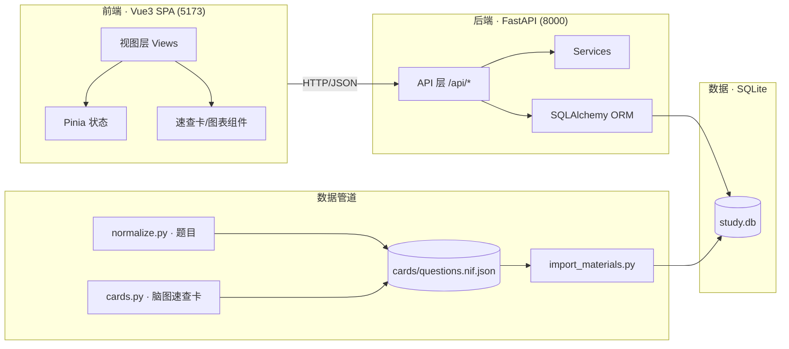

# 软考·系统架构设计师备考系统

> **Ruankao Study** · 面向中国计算机技术与软件专业技术资格（水平）考试——**高级·系统架构设计师**的全栈备考工作台。
> 以知识树为骨架，把「学、练、考、复盘、诊断」闭环到一套本地自托管应用里，目标 2026-11 考试。

本地化部署、无需联网即可使用；前端按「单色纪律」设计（唯一蓝色 accent、无渐变/光环/玻璃），可控可改。

---

## 功能特性

- **知识库 + 知识树** — 136 个大纲知识点，按考纲「计算机基础 / 工程与管理 / 架构设计主线 / 数学与管理 / 信息与安全 / 专业英语」六大域组织，可增删改、记掌握度。
- **能力星图** — 知识图谱画布（Canvas 力导向）：节点大小 = 主线权重 + 薄弱度 + 关联度；支持搜索、类型过滤、点击查看详情。
- **知识点速查卡** — 将高价值 Mermaid 思维导图解析成结构化卡（脑图树 / 关系边 / 表格 / 速记口诀），挂到对应知识点上，选中即速览（仅自用授权来源）。
- **练习模式** — 按知识点定向刷题，覆盖 综合知识 / 案例分析 / 论文 三种题型。
- **三科模拟考试** — 单选 / 案例 / 论文分科出卷、限时作答、自动判分。
- **错题本（SM-2 间隔复习）** — 错题自动归集，按间隔重复算法排期复习，并附**归因反思**（为何错、如何改）。
- **论文专项 + AI 批改** — 论文提纲打分（ADR），可选 AI 辅助批改（需配置 key）。
- **统计画像与学习计划** — 掌握度画像、薄弱点分析、阶段计划。

---

## 架构

前后端分离，单库自托管；数据为**单向流**：原始来源 → 解析/标准化 → 导入 → 存储 → 呈现，可随时重建。



### 技术栈

| 层 | 技术 |
|---|---|
| 前端 | Vue 3（`<script setup>`）· Vite 5 · Pinia · Vue Router 4 · ECharts · lucide-vue-next |
| 后端 | Python 3.12 · FastAPI · SQLAlchemy 2.0 · Pydantic v2 · uvicorn |
| 存储 | SQLite（WAL、FK 开启） |
| 数据 | 结构化 JSON（NIF）· 幂等导入管道 · 许可门控 |

---

## 快速开始

**一键启动（Windows）**：

```bat
start.cmd
```

自动起后端 `:8000` 与前端 `:5173`，并打开浏览器访问 http://127.0.0.1:5173。

**手动启动**：

```bash
# 1. 初始化数据库（会自动建表 + 补列迁移 + 种子数据）
python backend/scripts/init_db.py

# 2. 后端
cd backend && python -m uvicorn app.main:app --port 8000

# 3. 前端
cd frontend && npm install && npm run dev
```

**健康自检**：

```bash
python backend/scripts/health_check.py
```

> `tools/` 内附内嵌 Python 与工具脚本（已 gitignore），无需全局安装即可跑通全链路。

---

## 数据与内容现状

| 内容 | 数量 | 说明 |
|---|---|---|
| 大纲知识点 | 136 | 来自《系统架构设计师考试说明（2022 第二版）》解析的代码树 |
| 知识关系 | 33 | 前置 / 包含 / 冲突 / 主线 / 相关 |
| 题库 | 1093 | 单选 1082 · 案例 5 · 论文 6；`source_type` 自研 563 + 授权自用来源 530 |
| 知识点速查卡 | 9 | 由高价值 Mermaid 脑图解析，只读、挂具体知识点 |

题目**不是真题卷面逐字照搬**：自产题按官方考纲知识范围、参考真题题型与难度原创整理；外部真题仅引入授权自用来源并保留出处（详见下文许可）。

---

## 项目结构

```
.
├── backend/                 FastAPI + SQLAlchemy + SQLite
│   ├── app/
│   │   ├── models/          知识树 / 题目 / 错题 / 计划 / 统计 等 ORM 模型
│   │   ├── routers/         knowledge · questions · exams · wrong · plans · stats · essay · ai · learning …
│   │   ├── services/        业务逻辑（间隔复习、组卷、批改等）
│   │   ├── database.py      engine + 幂等迁移（补列）
│   │   └── main.py          应用装配
│   ├── scripts/             init_db / health_check / e2e_check / backup_db / pdf_extract / import_tool
│   └── tests/               pytest（8 项全绿）
├── frontend/                Vue3 + Vite
│   └── src/
│       ├── views/           Home / Graph / Knowledge / Practice / Case / Essay / Exam / Wrong / Plan / Stats / …
│       ├── components/      base · chart · knowledge（速查卡/脑图节点）· shell · home
│       ├── api/  router/  stores/  style.css（单色设计 token）
├── data/                    内容唯一权威源（题库 + 速查卡 + 来源元数据）
│   ├── syllabus/            architecture-syllabus.json（136 节点考纲树）
│   ├── questions/           自产题
│   ├── materials/<来源>/    questions.nif.json · cards.nif.json · ATTRIBUTION.md
│   └── sources/             catalog.json · normalize.py · cards.py（解析器）
├── docs/                    总纲 · PRD · 设计 · 需求 · 详细设计 · 使用指南
└── tools/                   内嵌 Python / 脚本（gitignore）
```

---

## 测试与运维

```bash
# 单元/接口测试
python -m pytest backend/tests

# 端到端巡检（起服务后）
python backend/scripts/e2e_check.py

# 数据库备份（保留最近 20 份）
python backend/scripts/backup_db.py
```

**数据幂等**：`data/import_materials.py` 是唯一跳板，知识点按 `code`、题目按 `stem` 去重，重复执行不产生脏数据。

**接新内容源**：`git clone --depth 1` → 在 `data/sources/catalog.json` 登记许可与结构 → 写 `normalize.py`/`cards.py` 适配器 → 生成 NIF → 重新导入。详见 [data/sources/README.md](data/sources/README.md)。

---

## 许可与版权

本仓库中**本项目自主编写的代码、题纲与文档**采用 **MIT 许可证**，详见 [LICENSE](LICENSE)。

### 内容来源与致谢

题库与知识点速查卡的**部分原始内容**来自公开备考仓库，本仓库仅在其中**注明出处并致谢**；各来源的版权归其原作者所有：

- [PeterGuy326/senior-software-architect-review](https://github.com/PeterGuy326/senior-software-architect-review)（`license: none`）—— 本项目**速查卡与部分题目**的内容来源；经作者授权学习自用，原始署名保留于 `data/materials/peterGuy326/ATTRIBUTION.md`。

> 本地 `ref/` 下另克隆了 [ruankaodaren/ruankao](https://github.com/ruankaodaren/ruankao)（MIT）作为**官方教材 PDF 参考**，仅用于研读，未导入仓库内容。其余来源索引见 [data/sources/catalog.json](data/sources/catalog.json)。

> 说明：本项目的 MIT 授权**不影响**第三方内容的自有版权；对其引用仅限学习自用，不在本项目许可内再分发。数据出处与授权策略详见 [data/sources/README.md](data/sources/README.md)。

---

## 文档导航

- [项目总纲与交接指南](docs/00-项目总纲与交接指南.md)
- [产品需求（PRD）](docs/01-产品需求/PRD-系统架构设计师备考工作台-v1.md)
- [产品设计：核心学习闭环与信息架构](docs/02-产品设计/核心学习闭环与信息架构-v1.md)
- [关键页面线框与交互](docs/02-产品设计/关键页面线框与交互状态-v1.md)
- [视觉与美术方案（单色纪律）](docs/02-产品设计/视觉与美术方案-v1.md)
- [软件需求（SRS）](docs/03-软件需求/SRS-P0-P1-学习闭环-v1.md)
- [概要技术设计与迁移方案](docs/04-技术设计/P0-P1-概要技术设计与迁移方案-v1.md)
- [详细设计 · 现有实现基线](docs/软考架构师备考系统-详细设计v1.md)
- [使用指南](docs/使用指南.md)
