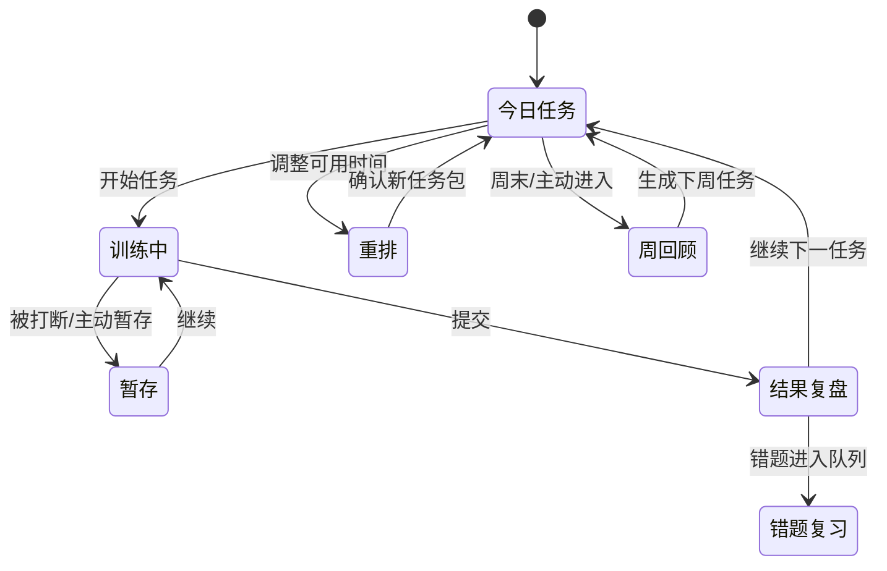

# 关键页面线框与交互状态 v1

| 项目 | 内容 |
| --- | --- |
| 文档状态 | Draft 1 |
| 产品阶段 | 产品设计：低保真线框与交互状态 |
| 覆盖范围 | 学习总览、首次诊断、训练工作台、训练结果、周回顾 |
| 上游文档 | `核心学习闭环与信息架构-v1.md`、`P0-P1-用户故事与验收场景-v1.md` |

## 1. 线框使用原则

本文件描述内容层级、操作路径和状态，不约束最终色彩、字号、图标或具体组件库。

- 单页只有一个最高优先级动作。
- 用户在任务流中始终可见：目标、进度、剩余时间/建议时间、暂存出口。
- 反馈按“结果 → 证据 → 下一步”排列，避免先堆统计图。
- 页面需要响应桌面和窄屏：信息从并列变为纵向堆叠，关键操作始终可达。
- 不用红色或百分比单独表达风险；必须配合文字标签和证据。

## 2. 全局框架

```text
┌──────────────────────────────────────────────────────────────────────┐
│ 软考备考工作台 · 系统架构设计师       [目标批次/设置] [备份状态]     │
├──────────────┬───────────────────────────────────────────────────────┤
│ 学习总览     │ 页面标题 / 当前学习上下文                             │
│ 今日任务     │                                                       │
│ 诊断         │ 主内容区                                               │
│ 知识地图     │                                                       │
│ 综合练习     │                                                       │
│ 案例工作台   │                                                       │
│ 论文工作台   │                                                       │
│ 模拟考试     │                                                       │
│ ──────────── │                                                       │
│ 错题与复习   │                                                       │
│ 能力画像     │                                                       │
│ 学习记录     │                                                       │
│ 内容与设置   │                                                       │
└──────────────┴───────────────────────────────────────────────────────┘
```

### 全局状态

| 状态 | 全局表现 | 用户可做的动作 |
| --- | --- | --- |
| 首次使用 | 主导航保留，但学习页引导至设置/诊断 | 开始诊断、先浏览知识地图 |
| 有进行中训练 | 顶部显示“继续上次训练” | 继续、暂存后离开 |
| 有到期复习 | 学习总览和错题入口显示文字提醒 | 直接开始复习 |
| 本地服务不可用 | 页面保留壳层并显示明确错误 | 重试、查看启动指引 |
| AI 不可用 | 仅在 AI 操作位置显示 | 使用自评/评分点继续学习 |

## 3. 页面 A：学习总览（今日任务行动台）

### 3.1 默认状态

```text
┌──────────────────────────────────────────────────────────────────────┐
│ 今天，8 月 28 日                                      [调整今天时间] │
│ 可用 35 分钟 · 已安排 3 项 · 三科状态：综合 临界 / 案例 高风险 / 论文 数据不足 │
├──────────────────────────────────────────────────────────────────────┤
│ 今天先做什么                                                            │
│ ┌──────────────────────────────────────────────────────────────────┐ │
│ │ 1  到期复习 · ATAM 架构评估                              12 分钟 │ │
│ │ 原因：今天到期；上次为高置信错误                                  │ │
│ │ 完成：重新作答并写一句复盘                         [开始复习]    │ │
│ └──────────────────────────────────────────────────────────────────┘ │
│ ┌──────────────────────────────────────────────────────────────────┐ │
│ │ 2  案例小问 · 性能与可用性取舍                          15 分钟 │ │
│ │ 原因：案例高风险；该主题近期表现较弱                              │ │
│ │ 完成：限时回答并对照评分点                         [开始训练]    │ │
│ └──────────────────────────────────────────────────────────────────┘ │
│ ┌──────────────────────────────────────────────────────────────────┐ │
│ │ 3  论文素材 · 补一张“质量属性取舍”事实卡                8 分钟 │ │
│ │ 原因：论文素材不足；与今天案例主题关联                            │ │
│ │ 完成：填写背景、职责、决策、结果                     [开始记录]  │ │
│ └──────────────────────────────────────────────────────────────────┘ │
├──────────────────────────────────────────────────────────────────────┤
│ 三科风险（点击查看证据与行动）                                        │
│ [综合知识：临界 · 题速偏慢] [案例：高风险 · 评分点遗漏] [论文：数据不足] │
├──────────────────────────────────────────────────────────────────────┤
│ [查看本周回顾]                                   [我想自由练习 →]  │
└──────────────────────────────────────────────────────────────────────┘
```

### 3.2 交互规范

| 元素 | 操作 | 结果 |
| --- | --- | --- |
| 调整今天时间 | 选择 15/30/60/120 分钟或自定义 | 未开始任务即时重排；说明延后项 |
| 开始任务 | 点击主操作 | 进入已预设的训练/记录，不再要求二次筛选 |
| 风险卡 | 点击 | 打开该科详情，定位到证据和最优先行动 |
| 自由练习 | 点击 | 进入题库筛选；显示“自由练习会计入画像” |
| 跳过任务 | 在任务更多菜单操作 | 要求选择原因；不降低掌握度 |

### 3.3 特殊状态

| 状态 | 主内容 | 主操作 |
| --- | --- | --- |
| 未诊断 | “先用一小时建立三科起点”与诊断说明 | 开始诊断 |
| 今天已完成 | 完成摘要、下一次到期复习、可选巩固动作 | 查看周回顾/自由练习 |
| 可用时间为 0 | 提示今天不安排强制任务 | 设定明日时间/仅查看复习队列 |
| 内容不足 | 解释缺少已审核题目的主题 | 导入或审核内容 |
| 有进行中任务 | 将其固定在任务列表顶部 | 继续训练 |

## 4. 页面 B：首次诊断

### 4.1 结构

```text
┌──────────────────────────────────────────────────────────────────────┐
│ 首次诊断                                              可随时暂存退出 │
│ 步骤：①设置  ━━━  ②综合  ━━━  ③案例  ━━━  ④论文  ━━━  ⑤报告     │
├──────────────────────────────────────────────────────────────────────┤
│ 当前：综合知识短题组                          建议 20–30 分钟       │
│ 目的：了解覆盖度、准确性、用时和把握程度，不等同于正式考试           │
│                                                                      │
│ 题目 4 / 20                                          建议剩余 18 分钟 │
│ 关于系统质量属性，下列说法……                                        │
│                                                                      │
│ ○ A …                                                                    │
│ ○ B …                                                                    │
│ ○ C …                                                                    │
│ ○ D …                                                                    │
│                                                                      │
│ 这题把握程度： ○ 不确定  ○ 一般  ○ 确定                               │
│                                                                      │
│ [上一题]                                      [暂存并稍后继续] [下一题] │
└──────────────────────────────────────────────────────────────────────┘
```

### 4.2 行为规则

- 诊断开始前必须显示总时长、组成和可暂存说明。
- 综合诊断中不展示正确性、累计分数或题目解析。
- 案例与论文允许“跳过并说明”，跳过不等于失败。
- 所有已提交输入自动保存；离开时仅对未保存的文本提示确认。
- 诊断报告是唯一可进入“生成第一周计划”的地方；用户可返回修改基础设置。

### 4.3 诊断报告线框

```text
┌──────────────────────────────────────────────────────────────────────┐
│ 你的第一份学习快照                                                      │
│ 结论基于：综合 20 题 · 案例 1 小问 · 论文素材盘点 · 数据可信度：初步   │
├───────────────────────┬───────────────────────┬───────────────────────┤
│ 综合知识：临界         │ 案例分析：高风险       │ 论文：数据不足         │
│ 证据：题速偏慢         │ 证据：评分点遗漏       │ 证据：尚无项目事实卡   │
│ [先练性能与可用性]     │ [先做案例小问]         │ [先建立一张事实卡]     │
├──────────────────────────────────────────────────────────────────────┤
│ 第一周建议：4 个学习日，合计约 3 小时                                  │
│ 周一 复习 + 综合短练 ｜ 周三 案例小问 ｜ 周末 论文提纲 + 周回顾         │
│ [调整可用时间]                                      [确认并生成任务]  │
└──────────────────────────────────────────────────────────────────────┘
```

## 5. 页面 C：训练工作台

### 5.1 通用布局

```text
┌──────────────────────────────────────────────────────────────────────┐
│ ← 返回今日任务    案例小问：性能与可用性取舍      已用 08:24 / 建议 15 分钟 │
│ 任务目标：写出 3 个评分点；完成后进行自评                              │
├─────────────────────────────┬────────────────────────────────────────┤
│ 题目/材料                     │ 我的作答                               │
│ 背景材料……                   │ ┌────────────────────────────────────┐ │
│ 问题：请说明……               │ │ 在此作答                             │ │
│                               │ └────────────────────────────────────┘ │
│ [标记困难]                    │ [暂存]                  [提交并自评]  │
├─────────────────────────────┴────────────────────────────────────────┤
│ 退出提示：当前内容已保存 · 任务尚未完成                                │
└──────────────────────────────────────────────────────────────────────┘
```

### 5.2 各训练类型的差异

| 类型 | 左侧/主体 | 作答方式 | 提交后的第一个反馈 |
| --- | --- | --- | --- |
| 综合题组 | 单题及题号进度 | 选择答案、可选置信度 | 正误与解析 |
| 案例小问 | 背景材料、小问、分值/建议时间 | 文本作答 | 先自评，再开放评分点 |
| 论文提纲 | 题目、可用事实卡、提纲骨架 | 结构化段落 | 事实覆盖和结构检查 |
| 论文全文 | 题目、提纲/事实卡侧栏 | 长文本、版本保存 | 字数、结构、事实复盘 |
| 错题复习 | 题干、历史反思（不含答案） | 重做/口述要点 | 与历史答案对照 |

### 5.3 防打断设计

- 文本输入在停止输入后自动暂存，并显示最近保存时间。
- 计时器仅记录用时，不因页面失焦自动判负；用户可明确暂停。
- 返回或关闭时，完成条件未满足则任务保持“进行中/暂存”。
- 用户可在所有训练页打开“任务说明”，不离开当前进度。

## 6. 页面 D：训练结束与复盘

```text
┌──────────────────────────────────────────────────────────────────────┐
│ 练习完成 · 性能与可用性题组                                            │
│ 8 / 12 正确 · 用时 14:10 · 其中 2 题为高置信错误                       │
├──────────────────────────────────────────────────────────────────────┤
│ 这次发现                                                                │
│ 1. 质量属性取舍：2 题错误，建议复习                                    │
│ 2. 缓存策略：答对但用时偏长                                            │
│ 3. 可用性：表现稳定                                                    │
├──────────────────────────────────────────────────────────────────────┤
│ 需要沉淀                                                                │
│ [错题 1] 错因： (知识) (理解) (审题) (方法) (时间) (其他)              │
│ 一句反思：___________________________________________________________ │
│ [保存复盘]                                                             │
├──────────────────────────────────────────────────────────────────────┤
│ 后续影响                                                                │
│ 已完成今日任务 2 / 3 · ATAM 将于 3 天后复习 · 案例风险仍为高            │
│ [继续下一任务]                                 [查看能力画像]         │
└──────────────────────────────────────────────────────────────────────┘
```

### 6.1 提交与复盘状态

| 状态 | 页面行为 |
| --- | --- |
| 有错题但未归因 | 结果先可见；“继续下一任务”允许但提示存在待复盘项 |
| 保存了部分反思 | 保存成功状态明确，未完成项仍保留 |
| 没有错题 | 不显示空的错因区域，改为巩固建议 |
| 任务完成但数据不足 | 显示完成，风险仅更新为“已增加证据” |
| AI 建议返回 | 与用户自评并列显示，包含接受/编辑/忽略动作 |

## 7. 页面 E：周回顾

```text
┌──────────────────────────────────────────────────────────────────────┐
│ 本周回顾 · 8 月 24 日至 8 月 30 日                        [选择周次] │
├──────────────────────────────────────────────────────────────────────┤
│ 实际学习 3h 20m / 计划 4h · 完成任务 7/9 · 到期复习完成 5/6           │
├───────────────────────┬───────────────────────┬───────────────────────┤
│ 综合：临界 → 临界     │ 案例：高风险 → 临界   │ 论文：数据不足 → 临界 │
│ 改变：题速改善         │ 改变：评分点覆盖增加   │ 改变：新增 2 张事实卡 │
├──────────────────────────────────────────────────────────────────────┤
│ 下周只做三件事                                                        │
│ 1. 保留每天到期复习（约 10 分钟）                                      │
│ 2. 完成 2 个案例小问，补“架构评估”评分点                               │
│ 3. 用事实卡完成 1 份论文提纲                                           │
│ 下周可用时间： [4 小时]                          [确认并生成下周任务] │
└──────────────────────────────────────────────────────────────────────┘
```

### 7.1 行为规则

- 周回顾默认显示最近完整自然周，允许查看历史周，但不回写历史结论。
- “风险变化”必须附带可解释证据；没有足够新增数据时显示“变化待观察”。
- 下一周建议最多三条，每条关联一个可生成任务类型。
- 修改下周时间后，系统显示优先保留和延后的任务，不自动删除已有计划。

## 8. 关键交互流程



## 9. 可用性验收

1. 新用户从首页到开始诊断不超过两次主要点击。
2. 已有用户从首页到开始今日主任务不超过两次主要点击。
3. 任一训练都能在不丢失内容的情况下暂存、离开、继续。
4. 训练提交后，用户无需跳转其他页面即可理解结果、复盘和下一步。
5. 当页面缩窄时，任务卡、题目/作答区、风险卡按纵向排列；操作按钮不被折叠隐藏。
6. 所有风险、异常和 AI 反馈均具有文字说明；不能只依赖颜色、图标或数字。

## 10. 后续产物

线框确认后，进入软件需求阶段，并按页面与流程编写：

- 角色与范围；
- 功能需求和状态机；
- 业务规则、数据需求、非功能需求；
- API 与数据模型的技术设计输入；
- P0/P1 端到端验收测试清单。
