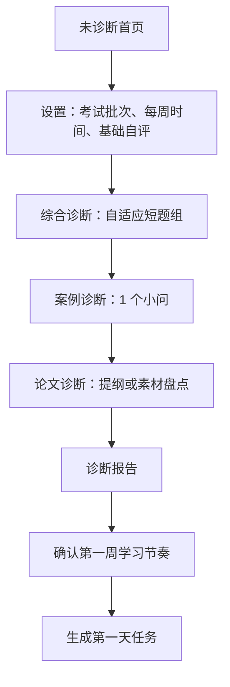
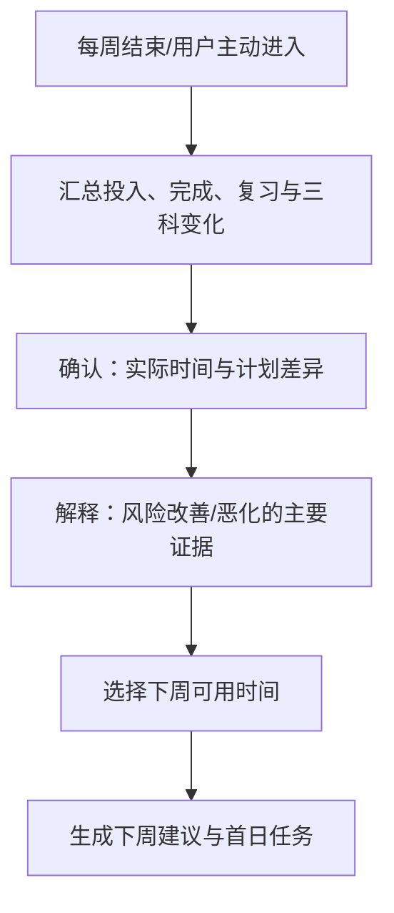

# 核心学习闭环与信息架构 v1

| 项目 | 内容 |
| --- | --- |
| 文档状态 | Draft 1：基于 PRD 待确认 |
| 产品阶段 | 产品设计（不包含数据库/API/组件实现） |
| 覆盖范围 | 首次诊断、今日任务、训练复盘、周回顾及一级信息架构 |
| 上游文档 | `docs/01-产品需求/PRD-系统架构设计师备考工作台-v1.md` |

## 1. 设计目标

本设计服务于 PRD 的北极星结果：用户在 30 秒内知道今天该做什么、为什么做、完成后有什么变化。

界面不以“模块入口的完整度”为第一目标，而以降低以下决策成本为第一目标：

1. 我现在的三科风险是什么？
2. 在可用时间内，最值得完成的动作是什么？
3. 这次练习到底暴露了什么问题？
4. 我有没有在持续接近考试目标？

## 2. 总体信息架构

```text
学习总览（默认落点）
├─ 今日任务                 # 每日执行入口
├─ 三科风险                 # 当前状态与证据
└─ 周回顾                   # 周期反馈与下周建议

学习与训练
├─ 首次/阶段诊断
├─ 知识地图
├─ 综合练习
├─ 案例工作台
├─ 论文工作台
└─ 模拟考试

复盘与资产
├─ 错题与复习队列
├─ 能力画像
├─ 项目事实卡 / ADR
└─ 学习记录

内容与设置
├─ 题库与导入审核
├─ 资格 / 考试配置
├─ 数据备份与导出
└─ AI 与隐私设置
```

### 导航原则

- 默认首页只承载“现在做什么”，不是所有指标的陈列墙。
- 训练内容按任务进入；独立入口保留给有明确意图的复习、查询或模拟。
- “错题”“素材”“学习记录”是用户资产，独立于一次训练的结果页。
- 高风险状态应可从首页、周回顾和任意训练结果页回到具体行动，不制造信息孤岛。

## 3. 核心状态模型

### 3.1 用户学习状态

| 状态 | 进入条件 | 默认界面重点 | 首要行动 |
| --- | --- | --- | --- |
| 未诊断 | 没有有效诊断和足够历史数据 | 说明诊断价值与时长 | 开始诊断 |
| 建立节奏 | 已诊断但学习记录少 | 第一周任务、轻量完成感 | 完成今日首个任务 |
| 稳定训练 | 有持续作答与复习数据 | 今日任务、分科风险、复习队列 | 完成高优任务 |
| 偏科预警 | 至少一科为高风险/临界 | 风险证据、纠偏任务 | 进入对应训练 |
| 冲刺 | 临近考试或用户手动选择 | 模拟、复习、时间能力 | 完成模拟/限时任务 |
| 数据不足 | 题目、标签或训练数据不足 | 缺口解释，不虚构结论 | 导入/审核内容或做诊断 |

### 3.2 任务状态

```text
草拟 → 已生成 → 进行中 → 已完成
                     ↘ 暂存
已生成 / 进行中 → 已跳过 → 等待重排
已生成 → 已过期 → 等待重排
```

- `草拟`：引擎生成但尚未确认展示，用于防止重复或不合理任务直接干扰用户。
- `已生成`：进入今日任务清单，显示推荐理由。
- `进行中`：用户已进入训练；可保存中途进度。
- `已完成`：满足任务完成条件，回写学习结果。
- `已跳过`：用户选择跳过并给出原因，不能当作掌握度负证据。
- `已过期`：当天未处理；次日由引擎判断继承、拆分或替换。

## 4. 首次诊断设计

### 4.1 目标

在不制造高压力的前提下，为三科分别建立第一份可解释的能力快照，生成可执行的第一周计划。诊断不是考试，也不能被表达为精准预测分数。

### 4.2 流程



### 4.3 诊断界面与交互

| 页面/步骤 | 用户看到什么 | 用户操作 | 系统反馈 |
| --- | --- | --- | --- |
| 开始页 | 预计总时长、三部分构成、可随时暂存 | 开始/稍后进行 | 不显示“必须一次完成” |
| 基础设置 | 考试日期、每周可用时长、是否有项目经历、三科自评 | 填写或使用默认值 | 即时估计本周任务负荷 |
| 综合诊断 | 每题、题号进度、剩余建议时长、置信度 | 作答并选择不确定/一般/确定 | 不在中途泄露答案 |
| 案例诊断 | 背景、一个小问、分值与建议时长 | 文字回答、自评完成度 | 可暂存，不强迫 AI 评分 |
| 论文诊断 | 主题、提纲骨架或事实卡清单 | 填提纲/跳过并说明 | 区分“没有项目素材”和“不会写” |
| 报告 | 三科风险、数据可信度、优势、首周建议 | 确认学习节奏 | 生成任务并允许编辑时间预算 |

### 4.4 诊断报告规则

- 报告必须展示“数据可信度”：题量不足时仅给方向，不给精确分数。
- 三科独立展示安全/临界/高风险与对应证据。
- 若论文未填写，显示“素材/提纲数据不足”，而不是判定论文能力低。
- 首周最多安排 5 个学习日；每个学习日默认 1–3 个任务，避免诊断后产生压迫感。

## 5. 今日任务：默认首页

### 5.1 页面结构

```text
┌──────────────────────────────────────────────────────────┐
│ 今天 · 可用 35 分钟                     三科风险：中/高/中 │
│                                                          │
│ [主任务] 复习：架构评估 ATAM · 12 分钟                    │
│ 原因：今天到期；上次高置信错误                             │
│                                      [开始复习]           │
│                                                          │
│ [次任务] 综合练习：性能与可用性 · 15 分钟                  │
│ 原因：案例薄弱主题；近年高频                               │
│                                      [开始练习]           │
│                                                          │
│ [迁移任务] 把“质量属性取舍”补进一张项目事实卡 · 8 分钟      │
│ 原因：论文素材不足；与今日案例主题关联                     │
│                                      [开始记录]           │
│                                                          │
│ 已完成 1 / 3 · 预计剩余 23 分钟      [调整今天时间]        │
└──────────────────────────────────────────────────────────┘
```

该线框只定义信息优先级，不约束视觉样式。

### 5.2 任务包生成原则

任务的选择顺序：

1. 到期复习（除非用户明确延期）；
2. 高风险科目中的高收益薄弱项；
3. 为防偏科而加入的跨科迁移或保底动作；
4. 用户主动设定的目标或未完成的阶段任务。

任务包满足以下限制：

- 默认总时长不超过用户当天设置的可用时间；
- 不在同一天堆叠超过一个高认知负荷任务（完整模拟、长案例、论文）；
- 任务应有明确结束条件，不出现“学习微服务”这类不可验证描述；
- 任务不足时显示“内容/数据不足”，并提供诊断或导入入口。

### 5.3 用户操作与异常状态

| 情形 | 交互 | 结果 |
| --- | --- | --- |
| 时间变少 | 调整 15/30/60/120 分钟或自定义 | 任务包重排，已开始任务不丢失 |
| 想自由练习 | 选择“自行选题” | 允许进入题库，但完成结果仍回写能力模型 |
| 无法完成 | 跳过并选择原因 | 保留记录，次日重新判断优先级 |
| 任务被打断 | 自动/手动暂存 | 下次从未完成位置恢复 |
| 没有任务 | 显示原因：已完成、数据不足或日期未设置 | 提供下一步入口 |

## 6. 训练与复盘设计

### 6.1 通用训练框架

任何训练均使用统一的四步框架：

```text
任务说明 → 作答/记录 → 结果与证据 → 复盘并更新后续行动
```

统一呈现：任务目标、预计时长、进度、暂存、结束条件。统一收集：完成时间、用时、答案/作品、置信度（适用时）、自评、用户备注。

### 6.2 综合知识练习

| 阶段 | 设计 |
| --- | --- |
| 开始 | 明示题量、目标时长、关联主题；默认不显示正确率压力 |
| 作答 | 单题/题组模式；每题记录答案、用时、置信度、标记 |
| 提交 | 展示正确性、解析、关联知识点和“置信度偏差” |
| 复盘 | 错题选择错因，写最小反思；生成复习或同类练习建议 |

高置信错误应被单独标记；它通常比低置信错误更需要概念澄清或审题复盘。

### 6.3 案例工作台

案例以“小问”为最小训练单元，避免只完成一整题后才得到反馈。


评分点呈现原则：先回答、后对照；按“已覆盖/可补充/不适用/待确认”组织，允许用户质疑或备注参考答案。

### 6.4 论文工作台

论文路径不从“空白编辑器”开始，而从“事实与结构”开始：

1. 选择论文主题或训练目标；
2. 推荐可用的项目事实卡及缺口；
3. 生成可编辑提纲（不是自动成文）；
4. 限时写作并保留版本；
5. 从结构、事实完整性、主题贴合、时间/字数进行复盘；
6. 需要时再使用 AI 建议，用户确认后保存。

用户可以只完成“提纲任务”或“事实卡任务”，两者都应作为有效训练，不将其误记为完整论文。

### 6.5 训练结束页

结束页用“结果 → 原因 → 下一步”组织：

| 区块 | 内容 |
| --- | --- |
| 本次结果 | 完成量、得分/自评、用时、置信度偏差 |
| 发现 | 优势、薄弱点、错因或遗漏评分点；只展示有证据的结论 |
| 后续影响 | 新增错题、下次复习、今日任务变化、风险变化（若数据足够） |
| 行动 | 复盘错题、继续下一任务、查看能力画像 |

## 7. 错题与复习队列

### 7.1 错题卡的最小信息

- 原题/关联小问与来源；
- 我的答案、正确答案或评分点；
- 错因（知识、理解、审题、方法、时间、表达、其他）；
- 一句反思：当时依据、正确判断、下次动作；
- 下次复习时间、历史表现和关联能力单元。

### 7.2 复习流程

复习不先展示答案。用户先回忆并重新作答/表述，再给出反馈；成功与否影响下次复习间隔。若连续错误，系统优先推荐回到知识讲解或案例评分点，而不是机械重复同题。

## 8. 三科风险与周回顾

### 8.1 风险卡

每科风险卡包含：

- 当前等级：安全 / 临界 / 高风险 / 数据不足；
- 关键证据：覆盖度、近期表现、时间能力、遗忘任务、最近模拟（有则展示）；
- 一项最优先行动；
- 查看详情入口。

风险卡禁止显示未经验证的“通过概率”。当数据不足时以数据不足替代等级。

### 8.2 周回顾流程



周回顾的输出上限为三条：继续做什么、停止/减少什么、下周最优先改善什么。避免将统计页变成用户的负担。

## 9. 页面状态与文案原则

| 状态 | 应表达 | 不应表达 |
| --- | --- | --- |
| 无学习数据 | “完成一次诊断后会生成建议” | “你的掌握度为 0%” |
| 题库不足 | “该主题尚缺已审核题目” | 伪造训练建议或用无关题填充 |
| 未设置考试日期 | “设置目标批次后可生成冲刺节奏” | 固定显示某一天倒计时 |
| AI 不可用 | “可先用自评和评分点完成复盘” | 阻塞写作、案例或错题流程 |
| 任务未完成 | “可重排或说明原因” | 惩罚性提醒、连续打卡羞辱 |

语言应使用“证据、建议、下一步”，避免绝对化的“你不会”“必过”“精准预测”。

## 10. 产品设计验收

P0/P1 设计通过评审需满足：

1. 新用户能从未诊断状态，在不超过 60 分钟内完成诊断并获得第一天任务。
2. 已有数据的用户能从首页在两次操作内开始一个任务。
3. 用户能在任意训练中保存进度，并在完成后看到结果与下一步。
4. 每一项自动任务都可解释推荐原因与完成条件。
5. 三科风险分开展示；数据不足时不显示虚假的精确结论。
6. 错题、案例和论文三条训练路径都能进入复习/资产沉淀，而不是只保存分数。

## 11. 后续设计产物

本文件确认后，继续在本目录完成：

1. `P0-P1-用户故事与验收场景.md`：按需求拆解用户故事、异常和验收示例；
2. `关键页面线框与交互状态.md`：为首页行动台、诊断、训练结束页、周回顾建立低保真线框；
3. 完成后进入 `docs/03-软件需求/`，将已确认的产品行为写成 SRS。
