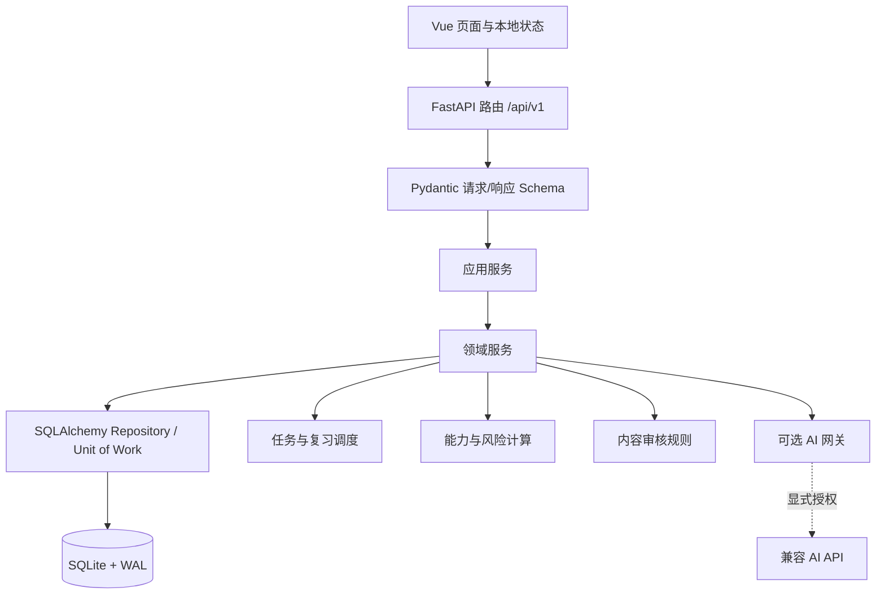

# P0-P1 概要技术设计与迁移方案 v1

| 项目 | 内容 |
| --- | --- |
| 文档状态 | Draft 1 |
| 设计层级 | 概要技术设计（HLD）+ 数据迁移方案 |
| 实现基线 | FastAPI + SQLAlchemy + SQLite + Vue 3 + Vite |
| 覆盖范围 | P0/P1 学习闭环，不改变现有本地优先部署形态 |
| 上游文档 | `docs/03-软件需求/SRS-P0-P1-学习闭环-v1.md` |

## 1. 设计结论

保留现有本地单机架构，采用“**增量领域扩展 + 显式数据库迁移 + 兼容旧接口**”的演进方式。

- 现有 `questions`、`knowledge_points`、`attempts`、`answers`、`wrong_questions` 等表是用户学习资产，不能重建或清空。
- 新增资格配置、诊断、任务、能力快照、内容审核、论文事实卡等领域表；对现有表只追加可空字段和索引。
- 用 Alembic 管理 SQLite schema migration；不再只依赖 `Base.metadata.create_all()`。
- 先引入服务层和 Pydantic schema，路由只负责协议转换；训练、任务、风险等规则不写进 Vue 页面或路由函数。
- 以 v1 API 兼容现有页面；P0/P1 新 API 使用清晰资源路径。旧的四阶段 `study_plans` 保留为历史计划，逐步由 `learning_tasks` 替代。

## 2. 当前基线与问题

### 2.1 已有资产

| 领域 | 现有实现 | 保留策略 |
| --- | --- | --- |
| 知识 | `knowledge_points`、`knowledge_relations` | 保留，补充资格/大纲版本归属 |
| 题库 | `questions`、`question_items`、`question_knowledge` | 保留，补充来源、审核状态和发布约束 |
| 考试作答 | `paper_templates`、`papers`、`attempts`、`answers` | 保留，补充会话/任务关联与作答元数据 |
| 错题复习 | `wrong_questions`、`review_logs`、SM-2 服务 | 保留，补充复习来源和连续失败处置 |
| 计划 | `study_plans` | 冻结为历史阶段计划；新功能转向 `learning_tasks` |
| 论文资产 | `essay_materials`、`adr` | 保留，迁移/扩展为事实卡和提纲领域 |

### 2.2 必须修复的技术限制

1. 当前 `create_all()` 只能创建缺失表，无法安全升级已有 SQLite 表。
2. 路由直接接收 `dict`，缺少请求/响应校验、明确错误码和版本化 schema。
3. `Question.status` 当前只表达 `active`，不能表达审核、争议和归档；`source_year` 无法记录场次、页码和来源说明。
4. `Attempt/Answer` 仅能表达基础作答，无法保存任务关联、置信度、暂存状态、案例评分点或文本版本。
5. 当前统计以全量历史正确率为主，无法产生分科风险、近期证据和可解释任务。
6. `Settings` 为硬编码类属性，考试目标、用户时间与隐私偏好无持久化模型。

## 3. 逻辑架构



### 3.1 后端分层职责

| 层 | 路径建议 | 责任 | 禁止事项 |
| --- | --- | --- | --- |
| 路由 | `app/routers/` | 鉴权前置（未来）、请求解析、调用服务、HTTP 错误映射 | 写业务计算、直接拼复杂 SQL |
| Schema | `app/schemas/` | Pydantic 输入输出、枚举、校验与 OpenAPI | ORM 会话操作 |
| 应用服务 | `app/services/` | 一个用户用例一个服务入口，事务边界 | 依赖 Vue/HTTP 对象 |
| 领域服务 | `app/domain/` 或 `services/` | 风险、任务、SM-2、诊断、审核规则 | 直接处理 HTTP |
| Repository | `app/repositories/` | 查询封装、聚合读写 | 承担业务策略 |
| Model | `app/models/` | ORM 映射、约束、索引 | UI 格式化与业务编排 |

首期可不强制引入完整 DDD 框架，但必须让“任务生成”“风险计算”“内容状态变化”离开路由函数。

### 3.2 前端边界

| 层 | 路径建议 | 责任 |
| --- | --- | --- |
| API 客户端 | `src/api/` | 资源请求、统一错误与超时处理 |
| Store | `src/stores/` | 当前用户设置、今日任务、进行中训练的跨页状态 |
| Composable | `src/composables/` | 计时、自动保存、任务恢复、表单草稿 |
| Feature | `src/features/diagnostic` 等 | 复杂业务流程的局部组件和状态 |
| View | `src/views/` | 路由页面组合，不承载计算规则 |

## 4. 领域模型演进

### 4.1 新增实体

| 实体 | 关键字段 | 用途 |
| --- | --- | --- |
| `user_profiles` | current_certification_id、timezone、weekly_minutes、preferences_json | 单用户偏好与学习约束 |
| `certifications` | code、name、level、status | 资格配置入口 |
| `subjects` | certification_id、code、name、full_score、pass_score、duration_min、sort_order | 科目独立风险与模板配置 |
| `syllabus_versions` | certification_id、version、effective_from、status | 大纲版本化 |
| `syllabus_nodes` | version_id、parent_id、code、name、subject_id、description | 未来替换/映射现有知识点 |
| `content_sources` | title、year、session、page_ref、source_type、note | 真题/资料来源与定位 |
| `diagnostic_sessions` | status、started_at、paused_at、completed_at、settings_snapshot_json、report_json | 可暂存诊断过程 |
| `diagnostic_parts` | session_id、subject_id、part_type、status、payload_json、result_json | 综合/案例/论文分段进度 |
| `learning_tasks` | date、task_type、subject_id、target_json、estimated_minutes、reason_json、status、completion_json | P1 核心任务实体 |
| `task_events` | task_id、event_type、occurred_at、payload_json | 重排、跳过、完成的可审计事件 |
| `mastery_snapshots` | date、subject_id、syllabus_node_id、evidence_json、mastery、risk_level、confidence | 能力与风险趋势 |
| `essay_fact_cards` | title、background、role、constraints、decision、outcome、topics_json、privacy_level | 论文真实项目事实资产 |
| `essay_outlines` | question_id、title、content_json、fact_card_ids_json、status、version | 提纲训练与版本 |
| `answer_assessments` | answer_id、assessment_type、result_json、source、confirmed_at | 置信度、案例自评、AI 建议等可扩展评价 |

### 4.2 现有实体的增量变更

| 表 | 新字段/变更 | 原因 |
| --- | --- | --- |
| `knowledge_points` | `certification_id`、`syllabus_version_id`、`syllabus_node_id`（均先可空） | 与资格和大纲版本关联 |
| `questions` | `certification_id`、`subject_id`、`source_id`、`review_status`、`published_at` | 取代模糊的状态与来源表达 |
| `question_items` | `suggested_minutes`、`rubric_json`、`status` | 支持案例小问评分点与时间 |
| `attempts` | `task_id`、`diagnostic_session_id`、`status`、`last_saved_at` | 关联任务/诊断，支持暂存 |
| `answers` | `confidence_level`、`submitted_at`、`draft_json` | 记录置信度和中途草稿 |
| `wrong_questions` | `source_type`、`source_answer_id`、`consecutive_failures`、`last_outcome` | 支持非选择题复习及失败升级 |
| `essay_materials` | `fact_card_id`（迁移映射，可空） | 保留旧素材并逐步迁移 |
| `study_plans` | 不新增核心依赖，仅补 `deprecated_at`（可选） | 保留旧页面/历史数据，防止新旧计划混用 |

`subject` 的整数列可继续保留为旧接口兼容字段，但新代码应优先使用 `subject_id` 外键。过渡期双写、读新优先、缺失时回退旧字段。

### 4.3 关键关系

```text
资格 1─N 科目 1─N 大纲版本 1─N 大纲节点
资格/科目/大纲节点 ←N─N 训练内容 ←N─1 内容来源

诊断会话 1─N 诊断分段
学习任务 0..1─1 训练会话(Attempt) 1─N 作答(Answer) 1─N 作答评价
作答/评分点遗漏 → 复习条目 → 复习日志

科目 + 大纲节点 + 作答证据 → 能力快照 → 分科风险 / 周回顾
论文题目 ← 提纲 ←N─N 项目事实卡
```

## 5. 核心服务设计

### 5.1 `DiagnosticService`

职责：创建/恢复/暂存诊断；生成报告；将已确认的诊断证据转化为初始风险和首周任务候选。

关键命令：

```text
start_diagnostic(profile_id, certification_id)
save_diagnostic_part(session_id, part_id, payload)
complete_diagnostic_part(session_id, part_id)
skip_diagnostic_part(session_id, part_id, reason)
generate_diagnostic_report(session_id)
confirm_first_week(session_id, available_minutes)
```

约束：报告生成幂等；未完成/跳过原因缺失的分段不得标为完成；报告必须携带数据可信度。

### 5.2 `TaskPlannerService`

职责：为日期生成并重排任务，不直接渲染文案。

输入：用户时间预算、到期复习、科目风险、近期能力证据、已开始任务、内容可用性、用户主动目标。

优先级伪代码：

```text
budget = available_minutes - sum(in_progress.estimated_minutes)
add due_review tasks while budget allows
add high_risk_subject tasks by expected_learning_value
add cross_subject_balance task if a subject lacks recent evidence
add user_goal tasks if budget allows
split/defer tasks exceeding budget
validate every task has published content, reason and completion condition
```

防重复规则：同一能力单元在配置冷却期内不重复生成同类型任务，除非到期复习、用户主动选择或连续失败升级。

### 5.3 `PracticeService` 与 `ReviewService`

`PracticeService` 负责创建/暂存/提交训练会话、写入作答、触发错题/评分点遗漏与能力事件。

`ReviewService` 负责创建复习条目、发起不泄题的复习、记录结果、调用现有 SM-2 算法、连续失败升级。

提交训练的事务边界：

```text
校验会话与内容状态
  → 保存作答和评价
  → 生成错题/复习条目
  → 写入学习事件
  → 完成或更新关联任务
  → 更新/排队重算能力快照
  → 一次提交事务
```

### 5.4 `RiskService` 与 `WeeklyReviewService`

`RiskService` 为每科计算：数据充分性、覆盖度、近期正确/评分表现、时间能力、到期复习欠账、最近模拟（如有）。

初版使用规则配置，输出结构必须包含：`level`、`confidence`、`evidence[]`、`reasons[]`、`calculated_at`。禁止只返回单一百分比。

`WeeklyReviewService` 读取每周任务、会话、复习和风险快照，产生最多三条可映射到任务类型的建议；不修改历史周结论。

### 5.5 `ContentGovernanceService`

职责：校验内容、切换审核状态、维护来源、阻止未发布/待核内容进入核心计算。

状态切换必须检查字段完整性；将已发布内容标为待核时，需要写审计事件，并从后续任务/诊断候选中排除。

## 6. API 概要设计

新接口统一使用 `/api/v1`，现有 `/api/*` 保持兼容，逐页迁移后再弃用。

| 资源 | 方法 | 用途 |
| --- | --- | --- |
| `/profile` | GET, PATCH | 读取/更新个人设置 |
| `/certifications`、`/subjects` | GET | 获取资格、科目、模板配置 |
| `/diagnostics` | POST, GET | 开始、查询诊断 |
| `/diagnostics/{id}/parts/{partId}` | PATCH, POST | 暂存、完成或跳过分段 |
| `/diagnostics/{id}/report` | POST, GET | 生成/获取报告 |
| `/tasks/today` | GET | 获取今天任务包和风险摘要 |
| `/tasks/{id}` | GET, PATCH | 读取、开始、暂存、跳过、完成任务 |
| `/tasks/replan` | POST | 按时间预算重排未开始任务 |
| `/practice-sessions` | POST, GET | 创建/恢复训练会话 |
| `/practice-sessions/{id}/draft` | PATCH | 保存草稿 |
| `/practice-sessions/{id}/submit` | POST | 提交训练并获取结果 |
| `/reviews/due` | GET | 获取到期复习 |
| `/reviews/{id}/attempt` | POST | 提交复习结果 |
| `/risk/summary` | GET | 三科风险摘要与证据 |
| `/weekly-reviews/{week}` | GET | 周回顾 |
| `/weekly-reviews/{week}/plan` | POST | 根据时间确认下周任务 |
| `/content/imports` | POST | 上传/提交暂存导入 |
| `/content/{id}/review-status` | PATCH | 审核、发布、待核、归档 |

### 6.1 协议规则

- 所有写接口要求 `Content-Type: application/json`，文件导入除外。
- 所有资源返回 `id`、`created_at`、`updated_at`（旧表迁移后逐步补齐）。
- 业务校验失败返回 422，状态冲突返回 409，资源不存在返回 404；不得用 200 包裹错误字符串。
- 提交、重排、发布等非幂等操作支持 `Idempotency-Key`，避免重试造成重复任务/重复错题。
- AI 响应需返回 `source: "ai"` 与 `requires_confirmation: true`。

## 7. 数据库迁移策略

### 7.1 工具选择

引入 Alembic，迁移文件版本化保存在 `backend/alembic/versions/`。应用启动时不自动执行 schema migration；启动前由显式命令执行迁移，防止用户数据被静默修改。

保留 `init_db()` 仅用于全新安装创建基础表，迁移完成后由 Alembic 负责版本演进。生产/用户数据库启动时检查 schema 版本并提示更新，不自行升级。

### 7.2 迁移批次

| 批次 | 变更 | 兼容措施 | 回滚 |
| --- | --- | --- | --- |
| M0 | 加入 Alembic、建立版本表、备份命令前置检查 | 不改业务表 | 删除迁移工具即可 |
| M1 | 新建资格/科目/用户设置/来源/诊断表 | 现有页面无依赖 | 可降级删除空新表 |
| M2 | 给知识/题目/作答/错题追加可空外键与索引 | 旧读取逻辑保持 | 保留列，应用回退旧字段 |
| M3 | 新建学习任务、任务事件、能力快照、作答评价表 | `study_plans` 不删 | 停用新功能即可 |
| M4 | 新建事实卡/提纲；迁移旧论文素材映射 | 旧 `essay_materials` 保留 | 保留原素材和映射记录 |
| M5 | 切换前端到 `/api/v1`，旧接口标记弃用 | 双读/双写监控期 | 切回旧页面/API |

### 7.3 SQLite 注意事项

- 每次迁移前必须运行 `backup_db.py` 并校验备份文件可打开。
- SQLite 对修改列、约束和删除列限制较多；需要表重建时，在迁移中使用 Alembic `batch_alter_table`，保留所有数据和索引。
- 使用外键约束和唯一索引；迁移后运行 `PRAGMA foreign_key_check`、完整性检查和样本查询。
- WAL 文件不单独作为备份恢复源；备份脚本应通过 SQLite backup API 或一致性副本生成数据库文件。

### 7.4 现有数据回填规则

1. 创建默认资格“系统架构设计师”和三条默认科目配置。
2. 将现有 `questions.subject` 映射到新 `subjects`；找不到映射的记录写审计日志并保留原值。
3. 将 `knowledge_points.subject` 映射到默认资格/科目；通用节点可关联多个科目或保持空科目待人工整理。
4. 将 `Question.status = active` 映射为 `review_status = published`，其他值映射为 `draft`/`archived`，并产出回填报告。
5. 为已有 `attempts`/`answers` 填充默认 `status = submitted`，不伪造置信度和草稿。
6. 旧 `study_plans` 保留；只在用户确认后基于其阶段信息生成新的任务候选，不自动转换成已完成任务。
7. 旧 `essay_materials` 保留原始内容；只有满足事实卡字段的记录才创建映射，其他保持普通素材。

## 8. 前端状态与恢复策略

### 8.1 推荐状态划分

| Store/Composable | 持久化位置 | 内容 |
| --- | --- | --- |
| `profileStore` | 后端 | 当前资格、时区、时间预算 |
| `todayStore` | 后端为真源，前端缓存 | 今日任务、风险摘要、重排状态 |
| `diagnosticStore` | 后端草稿 | 当前会话、分段进度、暂存状态 |
| `practiceSessionStore` | 后端草稿 + 本地短暂缓存 | 会话、答案草稿、计时状态 |
| `uiStore` | 浏览器本地 | 仅页面偏好、折叠状态，不保存核心学习结果 |

### 8.2 自动保存

- 文本草稿停止输入后 1–2 秒防抖保存；离开页面前强制提交一次草稿保存请求。
- 选择题答案在选择后即时保存或在短防抖内保存。
- 前端须展示“保存中 / 已保存于 xx:xx / 保存失败，重试”状态。
- 本地缓存仅做网络/刷新容错；后端成功响应才标记正式保存。

## 9. 安全、隐私与可观测性

1. API 密钥迁移至环境变量或仅本机私有配置文件，禁止存入 SQLite 导出和日志。
2. 日志中不得打印论文全文、API 密钥、完整导入文件或敏感项目事实。
3. 记录结构化领域事件：任务生成/跳过/完成、内容发布/待核、诊断完成、AI 请求状态、迁移执行。
4. 本地故障诊断日志可导出，但须让用户预览将包含的内容。
5. 将数据目录、备份目录和配置目录加入版本控制忽略规则；仅提交无敏感样例数据。

## 10. 测试设计

| 层级 | 覆盖目标 | 示例 |
| --- | --- | --- |
| 单元测试 | 领域规则 | 任务优先级、风险数据不足、SM-2 连续失败升级、状态转换 |
| Repository 测试 | 数据查询与约束 | 已发布内容过滤、任务重排不影响进行中项 |
| API 测试 | Schema/错误码/事务 | 暂存恢复、重复提交幂等、待核内容不可训练 |
| 迁移测试 | 老库升级 | 基线 `study.db` 复制后升级、数据行数/外键/历史作答校验 |
| E2E 测试 | 用户闭环 | 设置→诊断→任务→训练→复盘→周回顾 |
| 手工验收 | UX/容错 | 窄屏、断网/后端关闭、AI 失败、长文暂存 |

迁移验收最低要求：迁移前后原有题目、知识点、作答、错题、复习日志和论文素材的数量不减少；所有外键检查通过；旧页面仍可读取核心历史数据。

## 11. 实施顺序与完成定义

1. M0：备份校验、迁移框架、Pydantic schema 基础；
2. M1：资格/设置/内容状态与默认数据回填；
3. M2：诊断会话和报告；
4. M3：学习任务、任务重排、首页行动台；
5. M4：综合训练增强、案例小问与错题/复习升级；
6. M5：风险快照、周回顾、论文事实卡/提纲；
7. M6：新旧 API 迁移、E2E、备份恢复演练、文档更新。

P0/P1 完成定义：所有 M 级 SRS 需求有实现与自动化验收；旧数据完成备份和迁移验证；核心闭环可在本地无 AI 环境下完整运行；用户能恢复一份备份并继续学习。

## 12. 未决技术决策

| 决策 | 候选 | 建议 |
| --- | --- | --- |
| Schema migration | Alembic / 自研 SQL | Alembic，降低 SQLite 升级风险 |
| Schema 校验 | Pydantic v2 / 路由 `dict` | Pydantic v2，逐步替换 |
| 前端状态 | Pinia / 页面内 ref | Pinia 管理跨页会话与任务；局部表单用 ref |
| 风险计算 | 批量同步 / 后台队列 | 首期同步、可缓存；数据增长后引入本地任务队列 |
| 作答草稿 | 仅后端 / 后端+浏览器容错 | 后端真源 + 浏览器短暂容错 |
| AI 密钥 | Python 配置常量 / 环境+私有本地配置 | 环境变量或私有配置，禁止入库/导出 |
